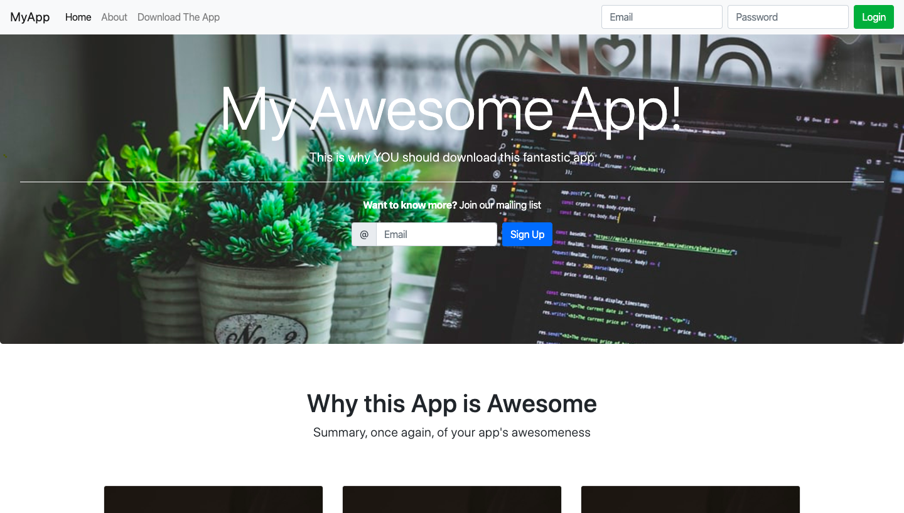
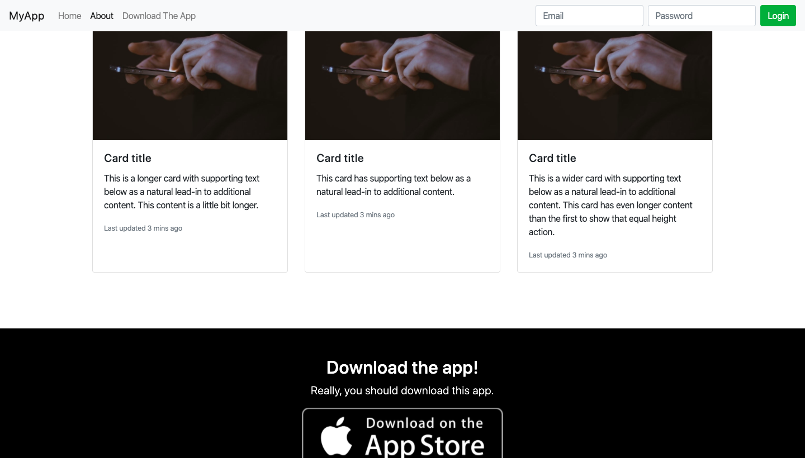
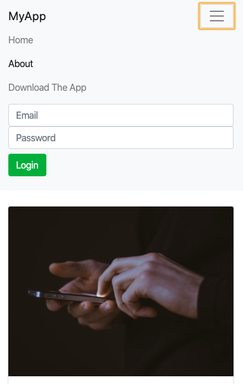

# BootstrapExample
A webpage developed only using the Bootstrap framework which demonstrates the key components in making a modern looking website. When the page is in desktop form, the navbar displays the different sections of the page but when the page is in mobile form, the navbar collapses into only a bar with a dropdown. The wepage also uses Bootstrap's Spycroll, this allows the Navbar to highlight on what section of the page the user is in as they are scrolling down the page.

# What I Learned
* Learned about different Bootsrap Components
* Navbar/Navbar collapse
* Container
* Jumbotron
* Card-deck
* Spyscroll

# Screenshots
* Desktop View

* Mobile View

